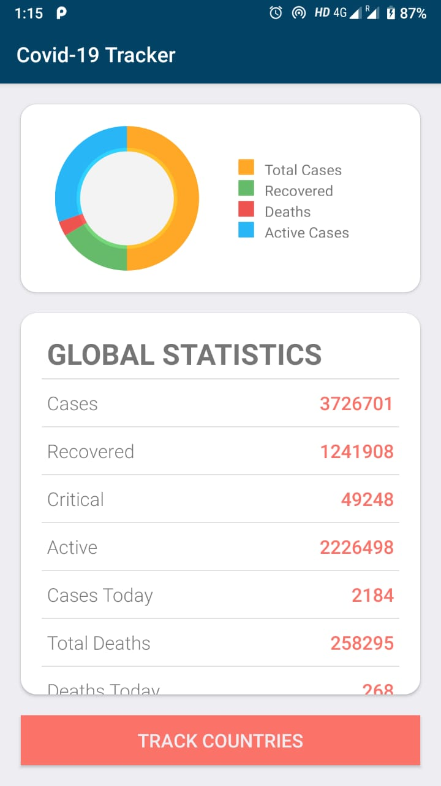
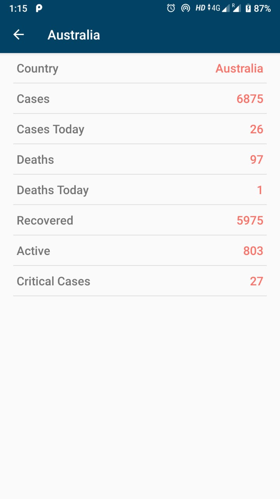

# Covid-19-Tracker
In this epidemic, one must be aware about everything going around. 
So here is an app which tracks the Covid-19 statistics and lets you know about the current scenario. 
This app is using REST API and volley for fetching the data.
The data gets updated in every 10 minutes.

### Global Statistics

This is the first activity which will show you the statistics of the people ainfected with covid-19 globally. This activity shows the data
in the form of Pie-Chart too.

The source for the pie-chart github repository is given here : https://github.com/blackfizz/EazeGraph

While the app fetches the data from the api a loader will run with some animation, which is the simple arc loader. The link for simple arc
loader is provided here : https://github.com/generic-leo/SimpleArcLoader

Link for Volley library : https://developer.android.com/training/volley

And the most important thing is from where we will get the statistics for each country. Well the API used here is :
https://corona.lmao.ninja/

And for the global statistics the api used is : https://corona.lmao.ninja/v2/all

### Affected Countries List

The next thing we want to do is to check the country-wise statistics for people infected from Covid-19. 
The api used for affected countries list is : https://corona.lmao.ninja/v2/countries , from here we will get the statistics for each 
affected country. We can fetch and display the affected countries from this list.

So when we press "Track Countries" button we will be redirected to an activity where all the countries affected by covid-19 is listed.

### Country-Wise Statistics

Next we can select any country and show the statistics for any country
The api used for country-wise statistics is : https://corona.lmao.ninja/v2/countries

Thus you can get the country-wise statistics and be well informed about everything.
